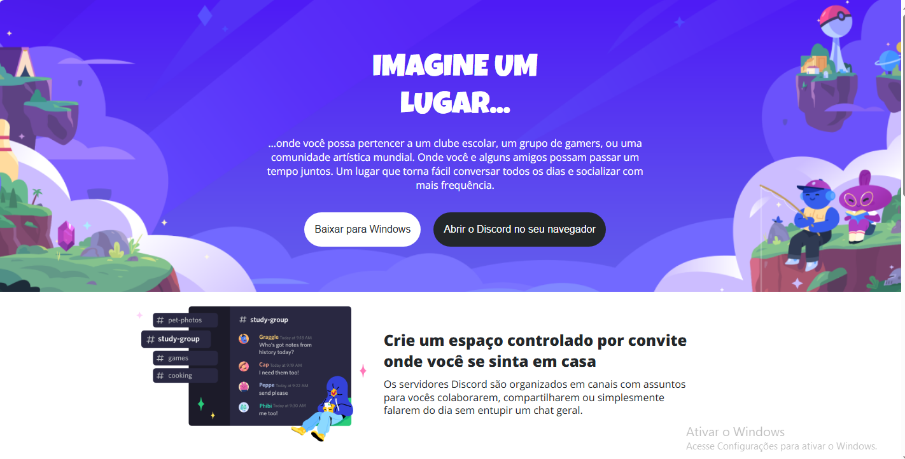
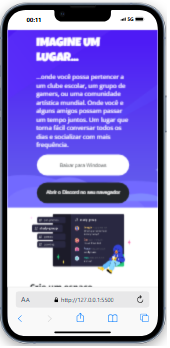

# Clone Discord

Este projeto é uma recriação da página inicial do Discord, construída com HTML e CSS para demonstrar habilidades de layout e responsividade.

## Prévia do Projeto



## Funcionalidades

- **Layout Responsivo:** Ajuste automático para diferentes tamanhos de tela.
- **Seções Alternadas:** Imagens e textogits alinhados alternadamente em cada seção.
- **Componentes de Interface:** Botões interativos para ações principais, como baixar e abrir o Discord.

## Estrutura de Pastas

```plaintext
├── index.html                    # Arquivo HTML principal
├── assets/
│   ├── css/
│   │   ├── reset.css             # Reset de estilos
│   │   ├── fonts.css             # Fontes utilizadas no projeto
│   │   ├── styles.css            # Estilos principais
│   │   └── media.css             # Estilos responsivos
│   └── image/                    # Imagens usadas no projeto
└── README.md                     # Documentação do projeto
```

### Tecnologias Utilizadas

- HTML5
- CSS3 (Flexbox e Grid Layout)

### Como Visualizar

1 - Clone o repositório:

```bash
git clone https://github.com/SergioDevSousa/CSS_responsive-discord.git
```

2 - Abra o arquivo index.html em seu navegador para visualizar a página



### Melhorias Futuras

- Implementar animações nos botões.
- Adicionar um menu de navegação interativo.
- Incluir uma versão com JavaScript para interações dinâmicas.

### Licença

Este projeto é de código aberto e está licenciado sob a MIT License.

Projeto criado por [Sérgio Sousa](https://github.com/SergioDevSousa) - GitHub
Meu [linkendin](https://www.linkedin.com/in/sergiosousa-tec/)
